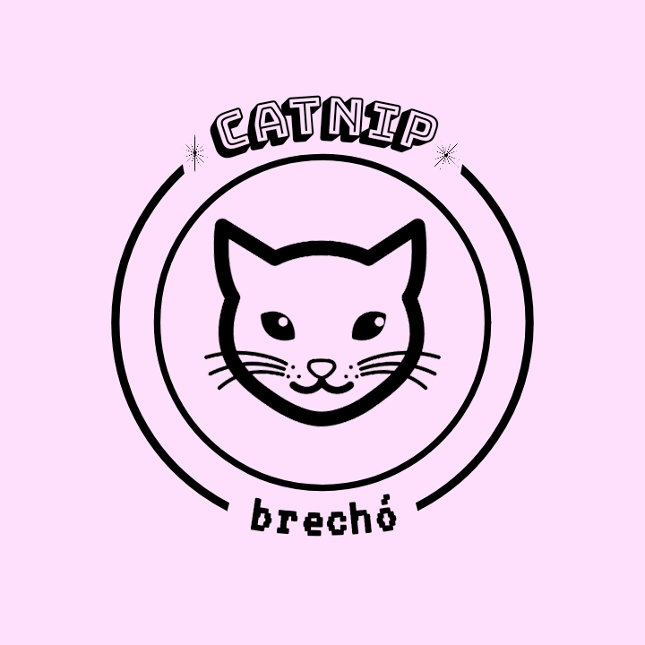

<h1 align="center">
    
</h1>

  <a href="#frontend-da-aplicação">Início</a>&nbsp;&nbsp;|&nbsp;&nbsp;
  <a href="#tecnologias">Tecnologias</a>&nbsp;&nbsp;|&nbsp;&nbsp;
  <a href="#adições-futuras">Adições futuras</a>

# Frontend da aplicação

&nbsp;&nbsp;&nbsp;&nbsp;__*Em desenvolvimento*__

- Contém telas de Cadastro Inicial, Login e Dashboard

- Autenticação de Login

## Tecnologias

- Esse projeto está sendo desenvolvido com as seguintes tecnologias:
  - [React](https://reactjs.org)

### Adições futuras

- Enviar imagens para o backend